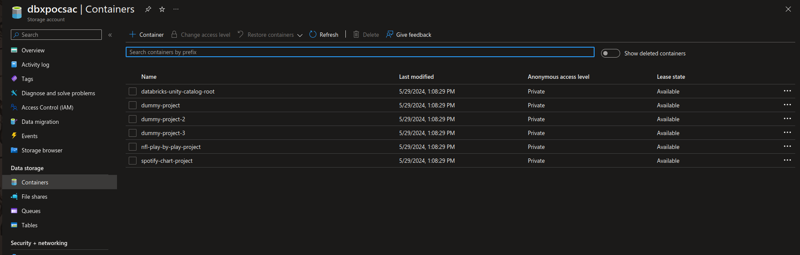
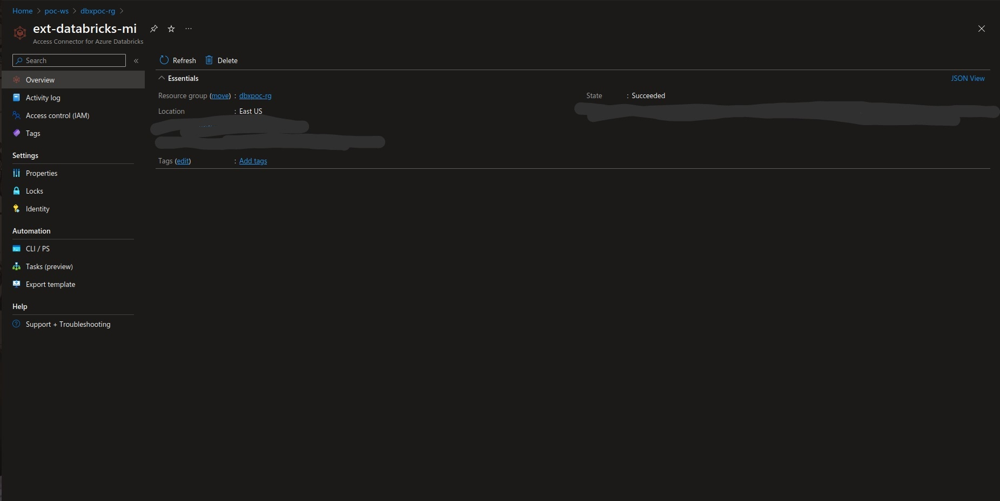
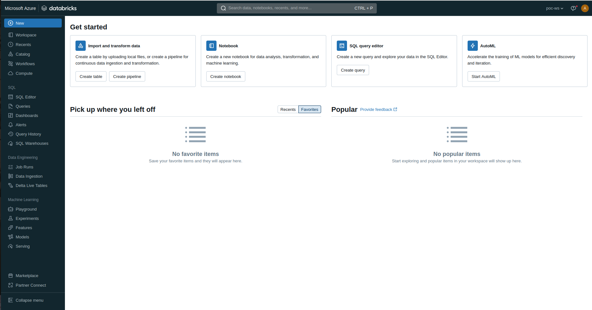
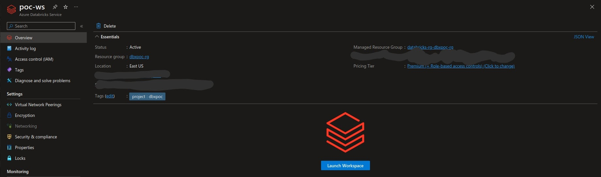
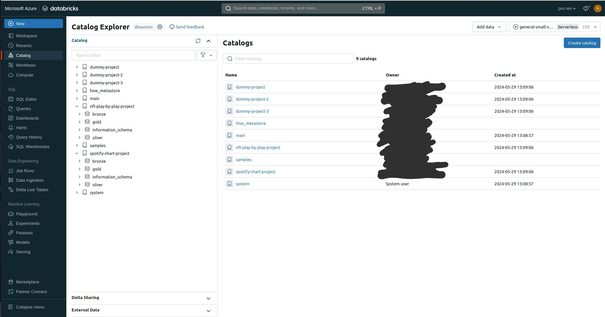

# databricks_poc
Repo to play around with Databricks workspace configuration. Deploys Data Lakehouse infrastructure using Terraform.
A general purpose shared Databricks Workspace, Access Connector, and Metastore are provisioned alongside a shared Storage Account.
Scaffolding is provisioned for specified data products, including dedicated storage containers, Databricks catalogs, and schemas adhering to a [medallion data architecture](https://www.databricks.com/glossary/medallion-architecture).








## Deploy Infra to Azure with Terraform

Login to Azure CLI

```bash
az login
```

Run terraform
```bash
cd terraform
terraform init
terraform apply -auto-approve -var-file=environment/poc.tfvars
```

## Clean up Infra
NOTE: may require manual metastore removal

```bash
terraform destroy -auto-approve -var-file=environment/poc.tfvars
```